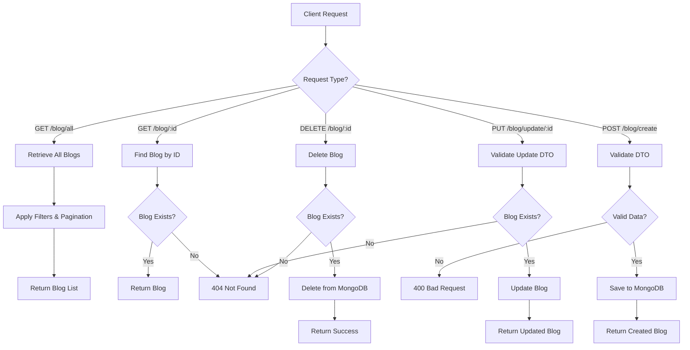
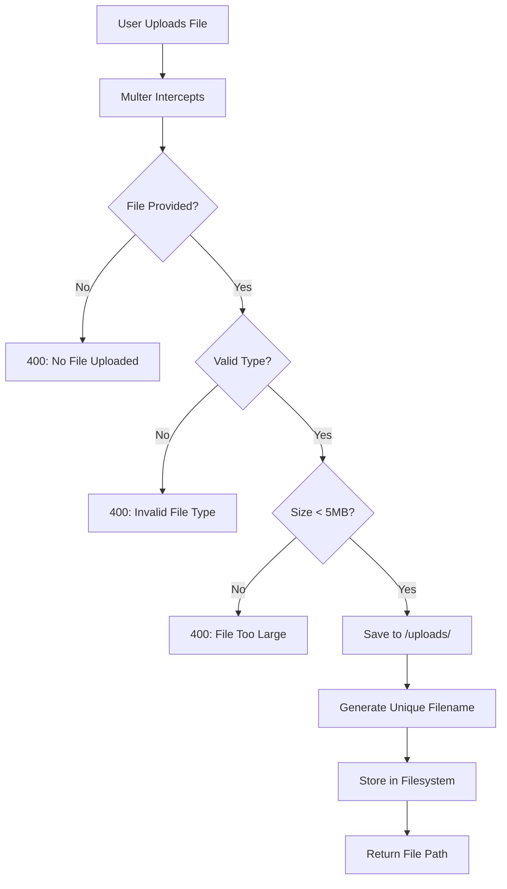
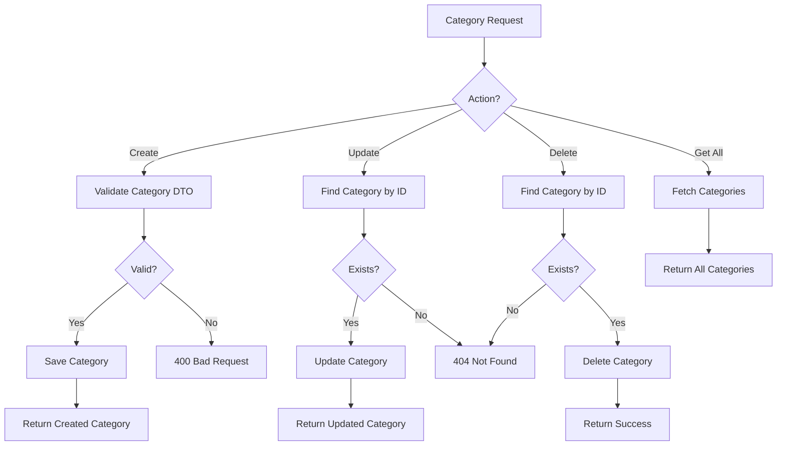
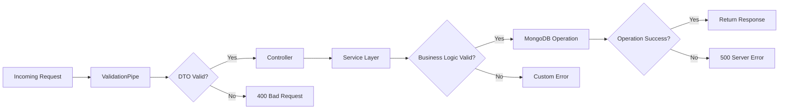
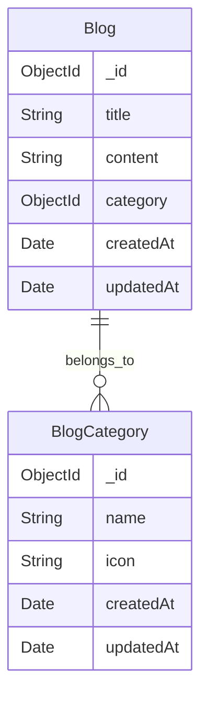
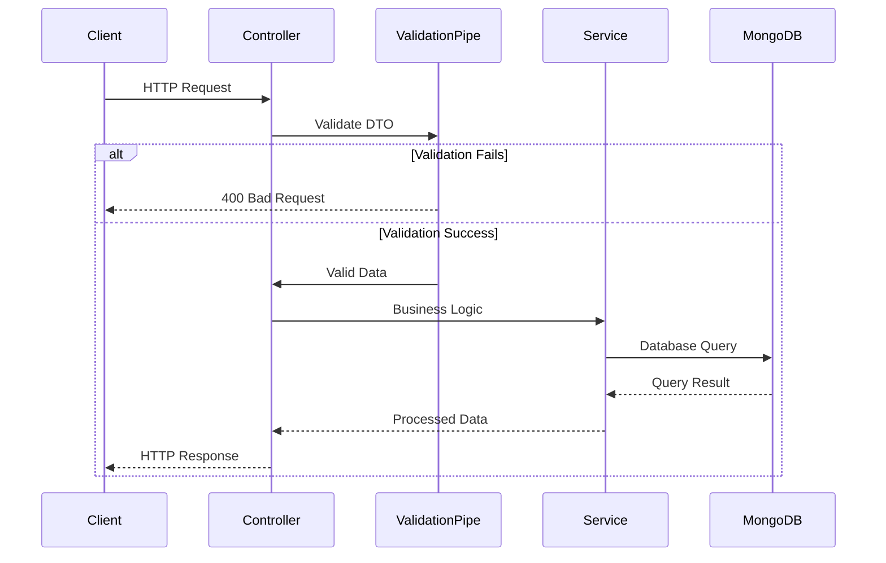
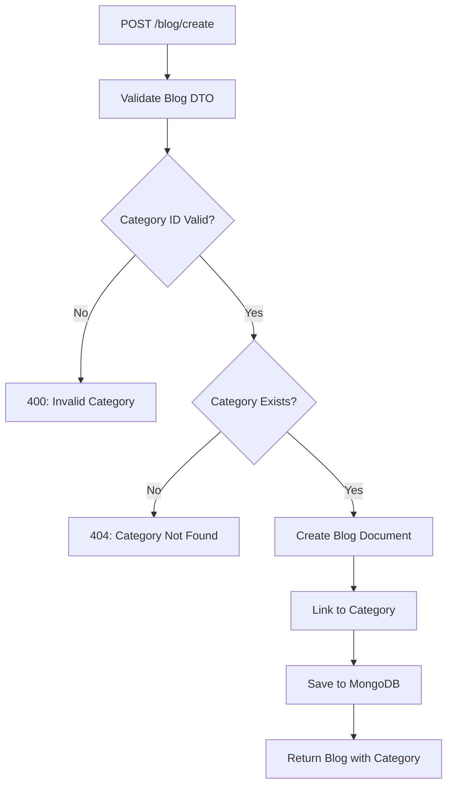
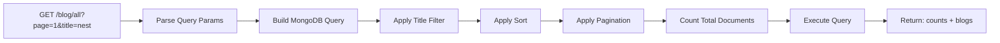

<div align="center">
  <h1>🚀 NestJS Blog & File Upload API</h1>
  <p><strong>A Learning Journey Through Modern Backend Development</strong></p>
  
  
  
  <p>
    
    
    
    
  </p>
</div>

---

## 📖 About This Project

This is a **hands-on learning project** built to master **NestJS fundamentals** through practical implementation. The project demonstrates core concepts including RESTful API design, database integration with MongoDB, file upload handling, and API documentation with Swagger.

### 🎯 Learning Objectives

- ✅ Master NestJS architecture (Controllers, Services, Modules)
- ✅ Implement CRUD operations with MongoDB & Mongoose
- ✅ Build RESTful APIs following best practices
- ✅ Handle file uploads with Multer
- ✅ Document APIs with Swagger/OpenAPI
- ✅ Implement validation with class-validator
- ✅ Work with DTOs and Schema design

---

## ✨ Features

### 📝 Blog Management
- Create, read, update, and delete blog posts
- Filter and search blogs by title
- Pagination and sorting support
- Category-based blog organization

### 🏷️ Category System
- Manage blog categories with icons
- CRUD operations for categories
- Link blogs to categories

### 📁 File Upload
- Upload images (JPEG, PNG) and PDFs
- File validation (type & size)
- Secure file storage with Multer
- 5MB file size limit

### 📚 API Documentation
- Interactive Swagger UI
- Auto-generated API documentation
- Try-it-out functionality for all endpoints

---

## 🛠️ Tech Stack

| Technology | Purpose |
|------------|---------|
| **NestJS 11** | Backend framework |
| **TypeScript** | Type-safe development |
| **MongoDB** | NoSQL database |
| **Mongoose** | MongoDB ODM |
| **Swagger UI** | API documentation |
| **Multer** | File upload handling |
| **Class Validator** | DTO validation |
| **Class Transformer** | Data transformation |

---

## 🚀 Getting Started

### Prerequisites

Make sure you have the following installed:
- **Node.js** (v18 or higher)
- **npm** (v9 or higher)
- **MongoDB** (running locally or remote connection)

### Installation

1. **Clone the repository**
   ```bash
   git clone <your-repo-url>
   cd app-two
   ```

2. **Install dependencies**
   ```bash
   npm install
   ```

3. **Configure MongoDB**
   
   Update the connection string in `src/app.module.ts`:
   ```typescript
   MongooseModule.forRoot("mongodb://localhost:27017/nestjs-app-two")
   ```

4. **Create uploads directory**
   ```bash
   mkdir uploads
   ```

### Running the Application

```bash
# Development mode with hot-reload
npm run start:dev

# Production mode
npm run start:prod

# Debug mode
npm run start:debug
```

The server will start on `http://localhost:3000`

### Access Swagger Documentation

Open your browser and navigate to:
```
http://localhost:3000/document
```

---

## 📂 Project Structure

```
src/
├── app.module.ts              # Root module
├── main.ts                    # Application entry point
├── blog/                      # Blog feature module
│   ├── blog.controller.ts     # Blog endpoints
│   ├── blog.service.ts        # Blog business logic
│   ├── blog.module.ts         # Blog module
│   ├── schemas/               
│   │   └── blog.schema.ts     # Mongoose schema
│   └── dtos/                  
│       ├── createBlogDto.ts   # Create blog DTO
│       ├── updateBlogDto.ts   # Update blog DTO
│       └── blogQuery.dto.ts   # Query params DTO
├── blog-category/             # Category feature module
│   ├── blog-category.controller.ts
│   ├── blog-category.service.ts
│   ├── blog-category.module.ts
│   ├── blog-category-schema.ts
│   └── dtos/
│       ├── createBlogCategoryDto.dto.ts
│       └── updateBlogCategory.dto.ts
└── file-upload/               # File upload module
    ├── file-upload.controller.ts
    ├── file-upload.service.ts
    └── file-upload.module.ts
```

---

## 🔌 API Endpoints

### 📝 Blog Endpoints

| Method | Endpoint | Description |
|--------|----------|-------------|
| `GET` | `/blog/all` | Get all blogs (with pagination & filters) |
| `GET` | `/blog/:id` | Get single blog by ID |
| `POST` | `/blog/create` | Create new blog |
| `PUT` | `/blog/update/:id` | Update blog |
| `DELETE` | `/blog/:id` | Delete blog |

### 🏷️ Category Endpoints

| Method | Endpoint | Description |
|--------|----------|-------------|
| `GET` | `/blog-category/all` | Get all categories |
| `GET` | `/blog-category/:id` | Get single category |
| `POST` | `/blog-category/create` | Create new category |
| `PUT` | `/blog-category/update/:id` | Update category |
| `DELETE` | `/blog-category/:id` | Delete category |

### 📁 File Upload Endpoints

| Method | Endpoint | Description |
|--------|----------|-------------|
| `POST` | `/file-upload/upload` | Upload a file (image/PDF) |

---

## 📊 Application Flows

### 🔄 Blog CRUD Flow



---

### 📁 File Upload Flow



---

### 🏷️ Category Management Flow



---

### 🔐 Request Validation Flow



---

### 🗄️ Database Schema Relationships



---

### 🌐 API Request Lifecycle



---

### 🔄 Blog Creation with Category



---

### 📊 Pagination & Filtering Flow



---

## 📋 Example Requests

### Create a Blog Post

```bash
POST /blog/create
Content-Type: application/json

{
  "title": "Getting Started with NestJS",
  "content": "NestJS is a progressive Node.js framework...",
  "category": "676c8f5e9a8b2c3d4e5f6789"
}
```

### Query Blogs with Filters

```bash
GET /blog/all?page=1&pageSize=10&title=nestjs&sort=createdAt
```

### Upload a File

```bash
POST /file-upload/upload
Content-Type: multipart/form-data

file: [your-file.jpg]
```

---

## 🧪 Testing

```bash
# Run unit tests
npm run test

# Run e2e tests
npm run test:e2e

# Generate coverage report
npm run test:cov
```

---

## 🔧 Development Scripts

```bash
# Format code with Prettier
npm run format

# Lint and fix code
npm run lint

# Build for production
npm run build
```

---

## 🎓 What I Learned

Throughout this project, I gained practical experience with:

- 🏗️ **Architecture**: Understanding NestJS modular architecture and dependency injection
- 🗄️ **Database**: Working with MongoDB and Mongoose ODM
- ✅ **Validation**: Implementing robust input validation with DTOs
- 📄 **Documentation**: Auto-generating API docs with Swagger decorators
- 📦 **File Handling**: Managing file uploads with security best practices
- 🔄 **REST APIs**: Designing clean and maintainable RESTful endpoints
- 🐛 **Debugging**: Troubleshooting common NestJS and MongoDB issues

---

## 🤝 Contributing

This is a learning project, but suggestions and improvements are welcome!

1. Fork the repository
2. Create your feature branch (`git checkout -b feature/AmazingFeature`)
3. Commit your changes (`git commit -m 'Add some AmazingFeature'`)
4. Push to the branch (`git push origin feature/AmazingFeature`)
5. Open a Pull Request

---

## 📝 License

This project is open source and available under the [MIT License](LICENSE).

---

## 🙏 Acknowledgments

- [NestJS Documentation](https://docs.nestjs.com) - Excellent framework documentation
- [Mongoose Documentation](https://mongoosejs.com) - MongoDB ODM guide
- [NestJS Community](https://discord.gg/G7Qnnhy) - Helpful community support

---

## 📬 Contact

If you have any questions about this learning project, feel free to reach out!

- 💼 [LinkedIn](#) - https://www.linkedin.com/in/amir-azadeh-ranjbar-2a1ba5205/
- 🐱 [GitHub](#) - https://github.com/amirazadehranjbar
- 📧 [Email](#) - amirazadehranjbar@gmail.com

---

<div align="center">
  <p>⭐ If this project helped you learn NestJS, consider giving it a star!</p>
  <p>Made with ❤️ and lots of ☕ while learning NestJS</p>
</div>
